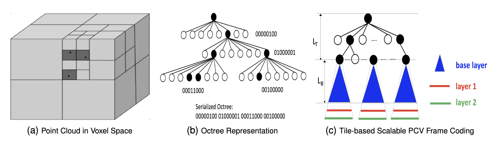
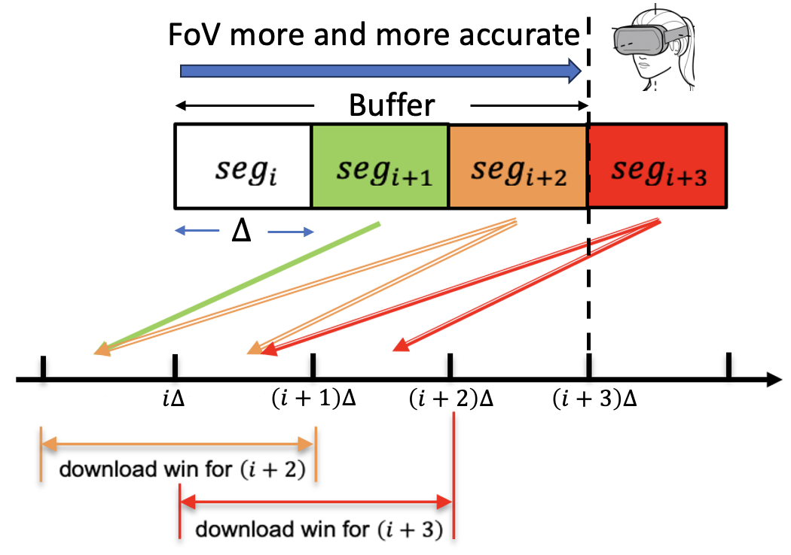

<!-- <!DOCTYPE html> -->

Paper Link:

<h1 id="abstract">Abstract</h1>

Many XR applications require the delivery of volumetric video to users with six degrees of freedom (6-DoF) movements. Point Cloud has become a popular volumetric video format. A dense point cloud consumes much higher bandwidth than a 2D/360 degree video frame. User Field of View (FoV) is more dynamic with 6-DoF movement than 3-DoF movement. To save bandwidth, FoV-adaptive streaming predicts a user's FoV and only downloads point cloud data falling in the predicted FoV. However, it is vulnerable to FoV prediction errors, which can be significant when a long buffer is utilized for smoothed streaming. In this work, we propose a multi-round progressive refinement framework for point cloud video streaming. Instead of sequentially downloading point cloud frames, our solution simultaneously downloads/patches multiple frames falling into a sliding time-window, leveraging the inherent scalability of octree-based point-cloud coding. The optimal rate allocation among all tiles of active frames are solved analytically using the heterogeneous tile rate-quality functions calibrated by the predicted user  FoV. Multi-frame downloading/patching simultaneously takes advantage of the streaming smoothness resulting from long buffer and the FoV prediction accuracy at short buffer length. We evaluate our streaming solution using simulations driven by real point cloud videos, real bandwidth traces, and 6-DoF FoV traces of real users. Our solution is robust against the bandwidth/FoV prediction errors, and can deliver high and smooth view quality in the face of bandwidth variations and dynamic user and point cloud movements.

<h1 id="FoV-adaptive Coding and Streaming">FoV-adaptive Coding and Streaming</h1>
<h2 id="Octree-based Scalable PCV Coding">Octree-based Scalable PCV Coding</h2>

A point cloud can be coded using an octree which is recursively constructed: the root node represents the entire space spanned by all the points, which is equally partitioned along the three dimensions into $2\times 2\times 2$ cubes; the root has eight children, each of which is the root of a sub-octree representing each of the eight cubes. The recursion stops at either an empty cube, or the maximum octree level $L$.  Each sub-octree rooted at level $l$ represents a cube with side lengths that are $1/2^l$ of the side lengths of the original space. To code the geometry, the root node records the $(x,y,z)$ coordinates of the center of the space, based on which the coordinates of the center of any cube at any level are uniquely determined. Consequently, each non-root node only needs one bit to indicate whether the corresponding cube is empty or not. For the octree in Fig. (b), the nodes with value $1$ at the three levels represent one, two and three non-empty cubes with side lengths of $1/2$, $1/4$ and $1/8$ in Fig. (a), respectively. All the non-empty nodes at level $l$ collectively represent the geometry information of the point cloud at the spatial granularity of $1/2^l$. This makes octree <i>spatially scalable</i>: with one more level of nodes delivered, the spatial resolution doubles (i.e., the distance between points is halved). The color attributes of a point cloud are coded following the octree structure as well, with each node stores the average color attributes of all the points in the corresponding cube. Scalable color coding can be achieved by only coding  the difference between a node and its parent. The serialized octree can be further losslessly compressed using entropy coding. With MPEG G-PCC, at each tree level $l$, the  status of a node ($0$ or $1$) is coded using context-based arithmetic coding, which uses a context consisting of its neighboring siblings that have been coded and its neighboring parent nodes to estimate the probability $p$ that the node is $1$.

<h2 id="Tile-based Coding and Streaming">Tile-based Coding and Streaming</h2>

<!--  -->

<!-- 

 -->

Considering the limited viewer Field-of-View (FoV) (dependent on the 6-DoF viewpoint), occlusions between objects and parts of the same object, and the reduced human visual sensitivity at long distances, only a subset of points of a PCV frame are <i>visible and discernible</i> to the viewer at any given time. FoV-adaptive PCV  streaming significantly reduces PCV bandwidth consumption by only streaming points visible to the viewer at the spatial granularity that is discernible at the current viewing distance. To support FoV-adaptive streaming, octree nodes are partitioned into slices that are selectively transmitted for <b>FoV adaptability</b> and <b> spatial scalability</b>. Each slice consists of a subset of nodes at one tree level that are independently decodable provided that the slice containing their parents is received. To enable FoV adaptability, a popular approach known as tile-based coding is to partition the entire space into non-overlapping 3D tiles and code each tile independently using a separate tile octree. Only tiles  falling into the predicted FoV will be transmitted. To enable spatial scalability within a tile, we need to put the nodes at each level of the tile octree into a separate slice. As illustrated in Fig. (c), each sub-octree rooted at level $L_T$ represents a 3D-tile with side length of $1/2^{L_T}$. Within each tile sub-octree, nodes down to the $L_B$ level are packaged into a base layer slice, and nodes at the lower layers are packaged into additional enhancement layer slices.

When the streaming server is close to the viewer, one can conduct reactive FoV-adaptive streaming: the client collects and uploads the viewer's FoV to the server; the server renders the view within the FoV, and streams the rendered view as a 2D video to the viewer. To facilitate seamless interaction and avoid motion sickness, the rendered view has to be delivered with short latency (e.g. $<$20 ms) after the viewer movement, the so called Motion-to-Photon (MTP) latency constraint. To address the MTP challenge, we consider predictive streaming that predicts the viewer's FoVs for future frames and prefetches tiles within the predicted FoV.

<h1 id="Progressive PCV Streaming">Progressive PCV Streaming</h1>

<!--  -->

Due to the close interaction with PCV objects, viewers are highly sensitive to  QoE impairments, such as black screen, freezes, restarts, excessively long latency, etc. Not only the network and viewer dynamics have direct QoE impacts, bandwidth and FoV prediction errors are also critical for the  effectiveness of predictive streaming. We propose a novel <i>progressive FoV-adaptive PCV  streaming design</i> to minimize the occurrence of the above impairments and deliver a high level of viewer QoE.

Scalable PCV coding opens up a new dimension to reconcile the conflicting desires for long streaming buffer and short FoV prediction interval. It allows us to <b>progressively download and patch</b> tiles: when a frame's playback deadline is still far ahead, we only have a rough FoV estimate for it, and will download  low resolution slices of tiles overlapping with the predicted FoV; as the deadline approaches, we have more accurate FoV prediction, and will <i>patch</i> the frame by downloading additional enhancement slices for tiles falling into the predicted FoV. <i>Progressive streaming is promising to simultaneously achieve streaming smoothness and robustness against bandwidth variations and FoV prediction errors.</i> On one hand, as shown in Fig. 2, each tile in each segment is downloaded over multiple rounds, the interval of which is $\Delta$. For example, tiles of $seg_{i+3}$ are downloaded in both round $i\Delta$ and round $(i+1)\Delta$. Traditional methods  download the segment only once in round $i\Delta$ based on the FoV prediction at this moment. The benefit of downloading $seg_{i+3}$ in two rounds is that FoV prediction in round $(i+1)\Delta$ is more accurate than in round $i\Delta$. Therefore, the bandwidth can be allocated to the tiles that would be more likely viewed by user.

<h1 id="selected-results">Selected Results</h1>

<table>
  <thead>
    <tr>
      <th><strong>Method</strong></th>
      <th><strong>333ms</strong></th>
      <th><strong>1000ms</strong></th>
      <th><strong>2000ms</strong></th>
      <th><strong>5000ms</strong></th>
    </tr>
  </thead>
  <tbody>
    <tr>
      <td><strong>LR</strong></td>
      <td>0.0043</td>
      <td>0.0102</td>
      <td>0.0173</td>
      <td>0.0229</td>
    </tr>
    <tr>
      <td><strong>TLR</strong></td>
      <td>0.0028</td>
      <td>0.0085</td>
      <td>0.0158</td>
      <td>0.0223</td>
    </tr>
    <tr>
      <td><strong>M-MLP</strong></td>
      <td>0.0036</td>
      <td>0.0093</td>
      <td>0.0137</td>
      <td>0.0232</td>
    </tr>
    <tr>
      <td><strong>M-LSTM</strong></td>
      <td><strong>0.0026</strong></td>
      <td><strong>0.0083</strong></td>
      <td>0.0126</td>
      <td>0.0146</td>
    </tr>
    <tr>
      <td><strong>Ours</strong></td>
      <td>0.0040</td>
      <td>0.0100</td>
      <td><strong>0.0110</strong></td>
      <td><strong>0.0120</strong></td>
    </tr>
  </tbody>
</table>

<em>Table 1: MSE of Visibility Prediction by Different Methods at Different Prediction Horizons</em>

In this table, we report the MSE losses for different methods across various prediction horizons. For short-term predictions (less than 1000 ms), our model maintains a relatively consistent cell visibility prediction loss. More importantly, for long-term cell visibility predictions, our model reduces the MSE loss by up to 20\% compared to all state-of-the-art methods. This improvement is significant for on-demand point cloud video streaming with target buffer length around 5 second. Our model effectively addresses the error amplification issue of trajectory-based methods, and captures the temporal and spatial patterns in viewer’s attention and cell visibility.

<!-- 

 -->

*Viewport prediction loss with different prediction horizon, from 10 frames(333ms) to 150 frames(5000ms).

Our model consistently outperforms all the state-of-the-art baselines across all prediction horizons, demonstrating the superiority of our spatial perception method over the traditional trajectory-based approaches. The performance gaps widen at the longer prediction horizon of 5 second (or 150 frames).

<h1 id="conclusion">Conclusion</h1>

In this paper, we introduce a novel spatial-based FoV prediction approach designed to predict long-term cell visibility for PCV. Our method leverages both spatial and temporal dynamics of PCV objects and viewers, outperforming existing state-of-the-art methods in terms of prediction accuracy and robustness. By integrating Transformer-based GNNs and graph attention networks, our model efficiently captures complex relationships between neighboring cells with a single graph layer. This approach overcomes the limitations of trajectory-based FoV prediction by incorporating the full spatial context, resulting in more accurate and stable predictions. Our spatial-based FoV prediction model presents a promising solution for long-term 6-DoF FoV prediction, immersive video streaming, and 3D rendering. We will make the code available to support further research and development in this area.

      
    

    
    
  </body>
</html>